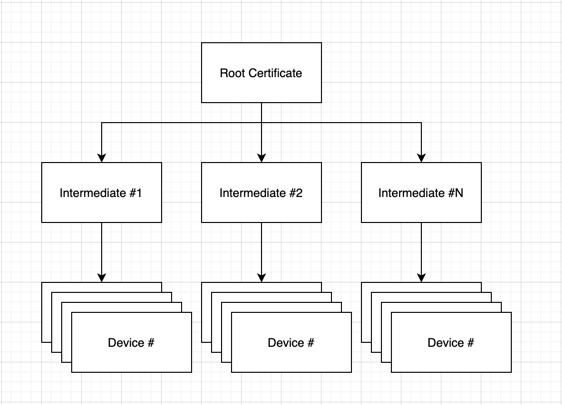
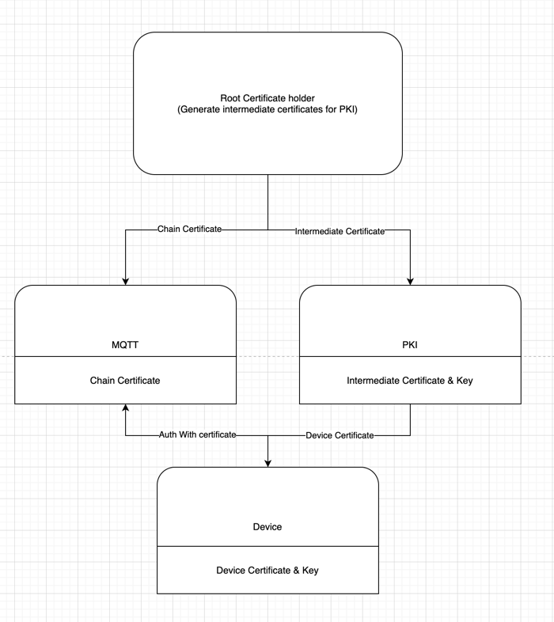

#Certificate generation scripts
##Purpose
To use SSL auth as first step we need create self-signed root and intermediate and store it like config in different services

###To Create root and intermediate certificate do following:
1. Open `init.sh`
2. Uncomment one of the lines with config setup (depends on environment)
3. Save and run `init.sh` script
4. Save all output somewhere
5. _To generate certificates for other environment you can run `clean.sh` script to remove all generated output_

###How provide certificates to other services
For staging and development certificates can be stored inside

###After script execution will be generated few folders and certificates
Folder /certs -> contains created certificates (root, intermediate, chain)
Folder /private -> contains private keys for certificates
Folder /csr -> contains certificate sign requests
Folder /newcerts -> folders with created certificates (king of local database of certificates)

Files index.* serial* -> local databases. needed to about some information duplication

**Please consider that for sensitive environments (production, staging) we need store all output somewhere to have ability generate new intermediate certificates in future**

###Certificate chain structure

###Services certificate structure

